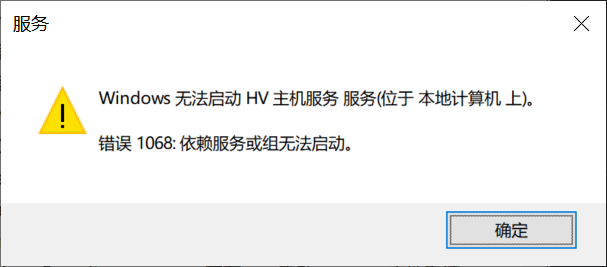

Windows功能：Hyper-V（控制面板-程序和功能-windows功能，win家庭版没有这个选项）

启动服务：HV主机服务（win+R中输入services.msc）

powershell：bcdedit /set hypervisorlaunchtype auto

VMware不支持Hyper-V：

GNS3：需要关闭Hyper-V, HV主机服务，bcdedit /set hypervisorlaunchtype off，VMware中关闭虚拟化引擎：虚拟化Intel VT-x/EPT 或AMD-I/RVI(V)

GNS3配置之后，DockerDesktop会报错：

WSL会报错(通过powershell打开wsl)：

